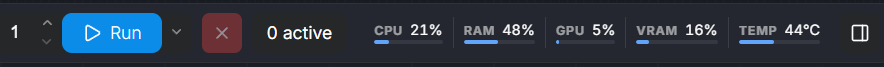
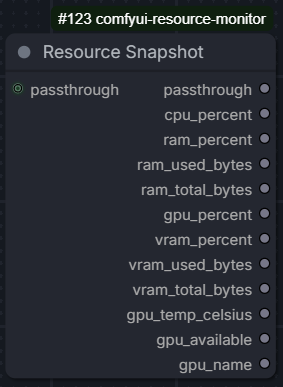

# comfyui-resource-monitor

`comfyui-resource-monitor` adds a simple live resource monitor to ComfyUI and a `Resource Snapshot` node for workflows. Created with [comfyui-custom-node-template](https://github.com/PBandDev/comfyui-custom-node-template).



It is designed to feel native to ComfyUI:

- `Top` mode mounts into the workflow action bar
- `Bottom` mode mounts into the canvas toolbar
- `Collapsed` mode becomes a `Resources` button in the top bar
- styling follows ComfyUI's existing colors and UI chrome

The monitor can show:

- CPU usage
- RAM usage
- GPU usage
- VRAM usage
- GPU temperature

## Install

### ComfyUI Manager

1. Open `Custom Nodes Manager`
2. Search and install `comfyui-resource-monitor`
3. Restart ComfyUI

## Use

After install, open ComfyUI settings and search for `Resource Monitor`.

Available settings:

- `Display Mode`: `Top`, `Bottom`, or `Collapsed`
- `Expanded By Default`
- `Refresh Rate`
- `Smooth Transitions`
- `Text Density`: `Compact` or `Detailed`
- `Show Clear Buttons`: show or hide the `Unload Models` and `Free Memory` toolbar buttons
- metric toggles for CPU, RAM, GPU, VRAM, and GPU temperature

Changes apply immediately in the UI.

### Clear Controls

Two toolbar buttons appear adjacent to the resource monitor:

- `Unload Models` — unloads currently loaded models from VRAM
- `Free Memory` — frees all memory, models, and VRAM

## Resource Snapshot Node

The node appears under `PBandDev/Resource Monitor` as `Resource Snapshot`.

It captures the machine's current resource state at the point where the node runs and outputs:

- `passthrough`
- `cpu_percent`
- `ram_percent`
- `ram_used_bytes`
- `ram_total_bytes`
- `gpu_percent`
- `vram_percent`
- `vram_used_bytes`
- `vram_total_bytes`
- `gpu_temp_celsius`
- `gpu_available`
- `gpu_name`

The optional `passthrough` input is forwarded to the `passthrough` output so the node can sit in the middle of a workflow chain.

If GPU telemetry is unavailable, GPU-related numeric outputs fall back to `0` and `gpu_available` is `false`.



## Troubleshooting

- If the monitor does not appear, restart ComfyUI and reload the browser tab.
- If the node appears but GPU values are `0`, your system may not expose NVML telemetry.
- If you changed frontend files locally during development, reload the browser tab.
- If you changed Python files locally during development, restart ComfyUI.

## Development

Install dependencies:

```bash
pnpm install
uv sync --locked --group dev
```

Checks:

```bash
uv run pytest tests/python -q
pnpm test
pnpm typecheck
pnpm build
```
